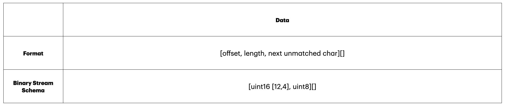

# rutf8-toolkit

Библиотека для сериализации и сжатия небольших кириллических текстов. Она предлагает различные алгоритмы для кодирования, сжатия и декодирования данных, поддерживая такие методы, как RUTF-8, Хаффман, LZSS, LZ77, BWT и RLE.

## Особенности

- **rutf8:** Храните и передавайте кириллические буквы в формате `uint8` c поддержкой Unicode.
- **Хаффман:** Кодирование переменной длины с использованием дерева Хаффмана.
- **LZSS и LZ77:** Компрессия текста через алгоритмы со скользящим окном.
- **BWT:** Преобразование Барроуза-Уилера для улучшения сжатия.
- **RLE:** Простое и эффективное кодирование повторяющихся символов.
- **Оптимальное сжатие:** Подсчет теоретически возможного минимального размера строки с помощью энтропии Шеннона.

## Комбинирование алгоритмов

Для более интересных результатов рекомендуется использовать несколько алгоритмов последовательно. Комбинация различных методов сжатия и кодирования может значительно повысить эффективность хранения и передачи данных. Например, можно предварительно обработать текст с помощью `RUTF8` или `BWT`, а затем применить `RLE` и кодирование Хаффмана для более эффективного сжатия.

## Модули

### 1) rutf8

`RUTF-8` — это собственный метод кодирования, который отображает русские символы Unicode в символы ASCII и наоборот. Это позволяет представлять русский текст однобайтовыми символами ASCII, сохраняя полную поддержку всех остальных символов Unicode.

#### Как это работает:

- Алгоритм выполняет двустороннее преобразование:
  - Русские символы заменяются на соответствующие ASCII при кодировании.
  - ASCII заменяются на соответствующие русские символы при декодировании.
- Поддерживаются все символы, поэтому ничего не теряется в процессе кодирования/декодирования.

#### Основные функции:

- `rutf8Encoder`: Кодирует русские символы в ASCII.
- `rutf8Decoder`: Декодирует ASCII обратно в русские символы.
- `binaryEncoder`: Кодирует двоичные данные с использованием `RUTF-8`.
- `binaryDecoder`: Декодирует двоичные данные, закодированные с помощью `RUTF-8`.

### 2) Хаффман

Модуль кодирования Хаффмана использует алгоритм дерева Хаффмана для кодирования текста переменной длины, что позволяет сжимать данные, присваивая короткие коды частым символам.

#### Как это работает:

- Анализирует частоту символов и генерирует оптимальные кодировки.
- Создает коды переменной длины для каждого символа с использованием дерева Хаффмана.
- Кодирует текст с использованием этих кодов и упаковывает дерево Хаффмана вместе с закодированными данными в двоичный буфер.
- Декодирует текст без необходимости в дополнительной схеме (безсхемное декодирование).

#### Основные функции:

- `binaryEncoder`: Кодирует двоичные данные с использованием Хаффмана.
- `binaryDecoder`: Декодирует двоичные данные с использованием Хаффмана.
- `createHuffmanTree`: Создает дерево Хаффмана из текстового ввода (можно визуализировать).

#### Двоичное кодирование


### 3) LZSS

`LZSS` — это оптимизированная версия `LZ77`, которая сжимает текстовые данные с помощью скользящего окна.

#### Как это работает:

- `Lookahead Buffer` (буфер предсмотра) содержит символы, которые алгоритм попытается сопоставить с `Search Buffer` (буфер поиска). Это помогает алгоритму находить повторяющиеся шаблоны.
- `Search Buffer` содержит уже обработанные символы и используется для поиска совпадений с `Lookahead Buffer`.
- LZSS кодирует повторяющиеся шаблоны в виде кортежей `[смещение, длина]`:
  - Кодирование происходит только если длина повторяющегося паттерна > 2 символов.
  - В остальных случаях символы кодируются как `uint8` (ASCII).
  - Если совпадение найдено в конце `Search Buffer`, алгоритм проверяет его на предмет возможности применения RLE.

#### Основные функции:

- `binaryEncoder`: Кодирует данные с помощью LZSS.
- `binaryDecoder`: Декодирует данные, сжатые с использованием LZSS.
- `encoder`: Позволяет увидеть схему кодирование LZSS.

#### Двоичное кодирование


### 4) LZ77

`LZ77` — один из базовых алгоритмов сжатия текста, предложенный Лемпелем и Зивом в 1977 году. Этот алгоритм также использует скользящее окно для поиска повторяющихся последовательностей символов.

- LZ77 кодирует символы и повторяющиеся шаблоны с помощью кортежей `[смещение, длина, следующий символ]`.
- Если совпадение найдено в конце `Search Buffer`, алгоритм проверяет его и применяет RLE, если это возможно.

#### Основные функции:

- `binaryEncoder`: Кодирует данные с использованием LZ77.
- `binaryDecoder`: Декодирует данные, сжатые с помощью LZ77.
- `encoder`: Позволяет увидеть схему кодирование LZSS.

#### Двоичное кодирование



### 5) BWT

Преобразование Барроуза-Уилера (BWT) — это алгоритм предварительной обработки данных, который переставляет символы текста для улучшения последующего сжатия.

#### Основные функции:

- `bwtEncode`: Кодирует текст с помощью BWT.
- `bwtDecode`: Восстанавливает оригинальный текст из BWT-кодированных данных.

### 6) RLE (Run-Length Encoding)

`RLE` — это простой, но эффективный алгоритм сжатия, который особенно хорошо работает с данными, содержащими длинные последовательности повторяющихся символов.

#### Основные функции:

- `rleEncoder`: Кодирует данные с использованием RLE.
- `rleDecoder`: Декодирует данные, сжатые с помощью RLE.

### 7) Прочее

- `calculateOptimalBytesCompression`: Функция вычисляет теоретически возможное минимальное количество байт для сжатия строки на основе энтропии Шеннона. Учтите, что эта оценка может не совпадать с фактическим результатом других методов сжатия.

## Установка

Для установки **rutf8-toolkit** используйте npm:

```bash
npm install rutf8-toolkit
```
